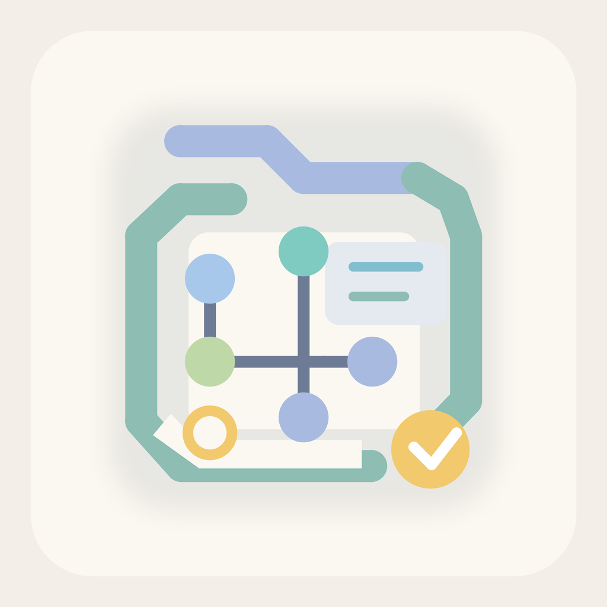

<p align="center">
  
</p>

<h1 align="center">ACK</h1>

<p align="center">
  <strong>Agent Config Keeper</strong><br/>
  Your AI agent's toolbox, managed from where you already work.
</p>

<p align="center">
  <a href="https://marketplace.visualstudio.com/items?itemName=koenrohrer.ack"></a>
  <a href="https://marketplace.visualstudio.com/items?itemName=koenrohrer.ack"></a>
  <a href="https://github.com/koenrohrer/ack/blob/master/LICENSE"></a>
</p>

---

Agent tools are scattered across JSON files in hidden directories. You add an MCP server here, a slash command there, tweak a permission somewhere else -- and none of it is visible until something breaks.

**ACK puts it all in one place.** See, install, toggle, and organize every tool your AI agent uses -- without ever opening a config file. Switch between Claude Code, Codex, GitHub Copilot, Pi, and Hermes with a single click.

<!-- Screenshot: sidebar tool tree showing MCP servers, commands, and hooks -->
<p align="center">
  
  <br/>
  <sub>The tool tree surfaces everything your agent can reach -- grouped, scoped, and one click away.</sub>
</p>

---

## What ACK Does

### Switch between agents

ACK detects your installed agents -- Claude Code, Codex, GitHub Copilot, Pi, and Hermes -- and reconciles them on startup: it auto-activates a single agent, re-activates your last-used one when several are present, or shows a chooser when there's no history to go on. Switch anytime from the status bar or command palette; the sidebar and config panel both context-switch to show the active agent's tools.

### See everything at a glance

The sidebar tree discovers your full agent configuration automatically. MCP servers, slash commands, hooks, and skills are grouped by type and labeled by scope (user vs. project) so you always know what's active and where it lives.

### Install tools from local files

Click the **+** on a tool group in the sidebar to install from your own disk -- pick a skill folder or a command file (single- or multi-file) and ACK writes it to the right location for the active agent, at user or project scope. Codex prompts and Copilot instructions install from a `.md` file the same way. No terminal, no manual JSON editing, no network.

### Switch contexts with profiles

Different projects need different tool setups. A profile is a **complete preset**: you pick exactly which tools it enables, and switching to it turns every other tool off. Profiles are scoped per agent -- each agent maintains its own set. If no profiles exist yet, switching profiles prompts you to create one right away.

- **Pick your tools** -- Choose which skills, servers, and commands a profile enables; everything else is turned off when you switch to it
- **Edit tools** -- Re-open the picker to add tools installed after the profile was created (it pre-checks what's already enabled)
- **Import / Export** -- Share configurations as portable bundles with agent compatibility metadata
- **Workspace association** -- Bind a profile to a workspace so it activates the moment you open it
- **Clone to agent** -- Copy a profile from one agent to another, filtering to compatible tools

<!-- Screenshot: profile switcher quick pick showing multiple profiles -->
<p align="center">
  
  <br/>
  <sub>Switch between tool setups as easily as switching Git branches.</sub>
</p>

### Configure your agent visually

<!-- Screenshot: config panel webview with model, permissions, and instructions -->
<p align="center">
  
  <br/>
  <sub>Edit model, permissions, and custom instructions through a form -- no JSON required.</sub>
</p>

Open the config panel from the command palette (`ACK: Configure Agent`) to edit your agent's settings through a proper UI. Model selection, permission levels, custom instructions, and MCP server configuration are all form fields instead of raw JSON.

### Organize and control inline

Every tool in the tree has inline actions:

- **Toggle** -- Enable or disable a tool without removing it
- **Move** -- Shift a tool between user and project scope
- **Delete** -- Remove a tool with optional confirmation

Right-click any tool for the full context menu.

---

## Quick Start

```
1.  Install the extension               code --install-extension koenrohrer.ack
2.  Open the ACK sidebar                Click the ACK icon in the activity bar
3.  Browse your tools                   The tree auto-discovers your config
4.  Install something new               Click the + on a tool group to add from a local file
```

---

## Commands

All commands are available from the command palette (`Ctrl+Shift+P` / `Cmd+Shift+P`).

| Command | Description |
|---------|-------------|
| `ACK: Configure Agent` | Open the visual config panel |
| `ACK: Switch Agent` | Switch the active agent (Claude Code / Codex / Copilot / Pi / Hermes) |
| `ACK: Initialize Codex for This Project` | Scaffold `.codex/config.toml` and `skills/` |
| `ACK: Re-detect Agents` | Re-run agent detection after installing a new CLI |
| `ACK: Switch Profile` | Switch to a saved profile |
| `ACK: Create Profile` | Create a profile by picking which tools to enable |
| `ACK: Save Tools as Profile` | Pick tools to enable as a new profile |
| `ACK: Edit Profile` | Modify an existing profile |
| `ACK: Delete Profile` | Remove a profile |
| `ACK: Export Profile` | Export a profile to a `.ackprofile` file |
| `ACK: Import Profile` | Import a profile from a `.ackprofile` file |
| `ACK: Clone Profile to Agent` | Copy a profile to another agent, filtering compatible tools |
| `ACK: Associate Profile with Workspace` | Bind a profile to auto-activate for this workspace |
| `ACK: Install Custom Prompt from File` | Install a prompt/instruction `.md` file for the active agent (Codex or Copilot) |
| `ACK: Refresh Tool Tree` | Force-refresh the sidebar tree |

---

## Settings

Configure ACK behavior in VS Code settings (`Ctrl+,` / `Cmd+,`).

| Setting | Type | Default | Description |
|---------|------|---------|-------------|
| `ack.showChangeNotifications` | `boolean` | `true` | Notify when agent config files are modified outside VS Code |
| `ack.skipDeleteConfirmation` | `boolean` | `false` | Skip the confirmation dialog when deleting tools |
| `ack.autoActivateWorkspaceProfiles` | `boolean` | `true` | Automatically activate the associated profile when opening a workspace |

---

## Supported Agents

| Agent | Config format | Tool types |
|-------|--------------|------------|
| **Claude Code** | JSON (`~/.claude/`, `.claude/`) | MCP servers, slash commands, hooks, skills |
| **Codex** | TOML (`~/.codex/`, `.codex/`) | MCP servers, skills, custom prompts |
| **GitHub Copilot** | JSON + Markdown (`.vscode/`, `.github/`) | MCP servers, custom instructions, custom agents |
| **Pi** | JSON (`~/.pi/agent/`, `.pi/`) | MCP servers, skills, custom prompts |
| **Hermes** | YAML (`~/.hermes/`) | MCP servers, skills, `SOUL.md` identity |

ACK auto-detects which agents are installed and activates one on startup -- your last-used agent when several are present. A status bar item lets you switch anytime, and each agent has its own sidebar view and profile set.

---

## Architecture at a Glance

```
┌─────────────────────────────────────────┐
│  VS Code Extension Host                 │
│                                         │
│  ┌─────────────┐   ┌────────────────┐  │
│  │  Tool Tree   │   │  File Watcher  │  │
│  │  (sidebar)   │   │  (live reload) │  │
│  └──────┬───────┘   └───────┬────────┘  │
│         │                   │           │
│  ┌──────┴───────────────────┴────────┐  │
│  │       Provider Registry           │  │
│  │  ┌────────────────────────────┐   │  │
│  │  │  Claude Code Provider      │   │  │
│  │  │  parsers / writers / paths │   │  │
│  │  └────────────────────────────┘   │  │
│  │  ┌────────────────────────────┐   │  │
│  │  │  Codex Provider            │   │  │
│  │  │  TOML parsers / writers    │   │  │
│  │  └────────────────────────────┘   │  │
│  │  ┌────────────────────────────┐   │  │
│  │  │  Copilot Provider          │   │  │
│  │  │  JSON + MD parsers/writers │   │  │
│  │  └────────────────────────────┘   │  │
│  │  ┌────────────────────────────┐   │  │
│  │  │  Pi Provider               │   │  │
│  │  │  JSON parsers / writers    │   │  │
│  │  └────────────────────────────┘   │  │
│  │  ┌────────────────────────────┐   │  │
│  │  │  Hermes Provider           │   │  │
│  │  │  YAML parsers / writers    │   │  │
│  │  └────────────────────────────┘   │  │
│  └───────────────────────────────────┘  │
│                                         │
│  ┌───────────────┐                      │
│  │ Config Panel  │                      │
│  │  (webview)    │                      │
│  └───────────────┘                      │
└─────────────────────────────────────────┘
```

---

## Privacy

ACK works entirely on your local machine. It reads and writes agent configuration files on disk, and does not collect telemetry, phone home, or transmit any data over the network.

---

## Contributing

See [CONTRIBUTING.md](CONTRIBUTING.md) for setup instructions and guidelines.

---

## License

[MIT](LICENSE) -- Koen Rohrer
